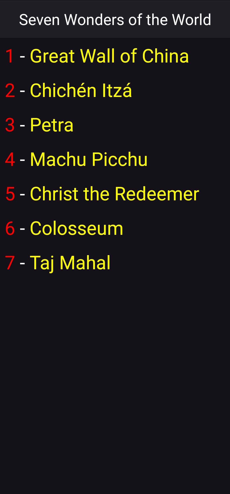

# Seven Wonders of the World (Android • Java)

An Android application showcasing the Seven Wonders of the World. The app presents a scrollable list (RecyclerView) of wonders with name and index. Selecting an item navigates to a detail screen featuring the wonder's image, country, and a richly formatted description. Built with modern Android tooling (AGP 8.x, Material3 theme, View Binding) and a clean, minimal Java codebase.

## Features
- RecyclerView list of the seven wonders with dynamic binding.
- Detail screen with full descriptions and image asset per wonder.
- View Binding enabled for safer, null-safe view access.
- Material3 dark theme with a custom action bar layout.
- Edge-to-edge UI configuration.
- Simple, immutable data model (`Wonder`).

## Tech Stack
- Language: Java (source/target compatibility 1.8)
- Minimum SDK: 24 (Android 7.0)
- Compile/Target SDK: 36
- Build System: Gradle (Version Catalog + AGP 8.13.1)
- UI: RecyclerView, GridLayoutManager (1 column), Material Components
- Testing: JUnit 4, AndroidX Test, Espresso (dependencies declared)

## Project Structure
```
app/
  src/main/java/com/receparslan/sevenwondersoftheworld/
    model/          -> Wonder data class
    adapter/        -> RecyclerAdapter for RecyclerView binding
    views/          -> Activities: MainActivity & DetailActivity
  src/main/res/     -> Layouts, drawables, mipmaps, values
  AndroidManifest.xml
screenshots/        -> UI screenshots referenced below
README.md
LICENSE
```

## Screenshots
| List Screen | Detail Screen |
|-------------|---------------|
|  |  |

> Images are stored under `screenshots/` and referenced relatively so they render on GitHub.

## Getting Started
### Prerequisites
- Android Studio (latest stable)
- JDK 17 installed (Gradle/AGP 8.x require JDK 17; code targets Java 8 bytecode)
- Android SDK Platform 36 + Build Tools installed

### Clone & Open
```bash
git clone https://github.com/receparslan4247/Seven-Wonders-of-the-World-Java.git
cd Seven-Wonders-of-the-World-Java
```
Open the project in Android Studio; Gradle sync should start automatically.

### Build from Command Line (Windows PowerShell)
```powershell
./gradlew.bat clean assembleDebug
```
APK output: `app/build/outputs/apk/debug/app-debug.apk`.

### Run
1. Connect a device or start an emulator (API 24+).
2. From Android Studio: Run ▶ (select `app`).
3. Or install the built debug APK via `adb install -r app/build/outputs/apk/debug/app-debug.apk`.

### Tests
Unit tests (none yet authored beyond dependencies):
```powershell
./gradlew.bat test
```
Instrumented tests (requires device/emulator):
```powershell
./gradlew.bat connectedAndroidTest
```

## Data Model
`Wonder` contains:
- `name` (String)
- `country` (String)
- `information` (String, long-form description)
- `image` (int resource ID)

Data is currently hard-coded in `MainActivity#setWonders()`. Future enhancements could externalize this to a local JSON asset or remote API.

## Possible Improvements
- Migrate to Kotlin for more concise code.
- Use Jetpack Navigation Component for screen transitions.
- Add unit/instrumented tests for adapter & activities.
- Implement dark/light theme toggle.
- Localize strings for multiple languages.
- Persist favorites or viewing history.

## Contributing
Contributions are welcome! Please:
1. Fork the repository.
2. Create a feature branch: `git checkout -b feature/my-improvement`.
3. Commit changes with clear messages.
4. Open a Pull Request detailing rationale and screenshots (if UI changes).

## License
This project is licensed under the MIT License – see the [LICENSE](LICENSE) file for details.

## Author
Created by **Recep Arslan**.

## Acknowledgments
- Public domain / educational descriptive texts adapted for demo purposes.
- Android Jetpack & Material Components.

---
If you use this project, feel free to star the repo and share improvements!
